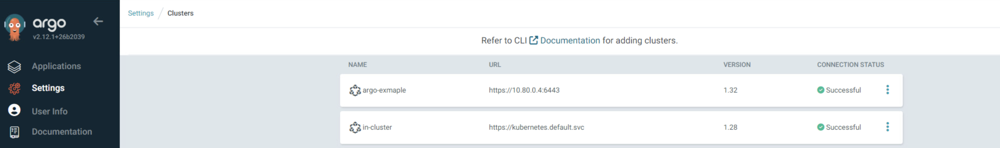

# ArgoCD auto Attach Service

This supervisor service can be used to automatically add workload clusters to ArgoCD as they are deployed or after the fact by using a label on the cluster. This is currently paired with this [ArgoCD service](https://vsphere-tmm.github.io/Supervisor-Services/#argocd-operator).


## How it works

ArgoCD currently runs centralized in the supervisor cluster. When deploying workload clusters by default these clusters are not registered back to ArgoCD. This supervsior service handles that by introducing a controller that watches for clusters being created that have the label `argocd-attach`. When a cluster is detected it will generate a secret that matches the ArgoCD secret spec for a cluster and use the contents of the kubeconfig for that cluster to generate that secret. This secret is managed with the cluster's lifecycle so it will also be cleaned up if a clusteris deleted.

## Install

1. login into VCenter and go to the worload management->services page
2. add a new service and upload the argo-attach.yml
3. add any additional values that are needed, most commonly used will be the python_image which overrides the image location for the  controller.
4. install

## Usage

Once the service is installed and also ArgoCD is installed. Follow these steps

1. Login to ArgoCD and and create a new app with the below settings or apply this application below into the supervisor namespace that ArgoCD is running in.

```yaml
apiVersion: argoproj.io/v1alpha1
kind: Application
metadata:
  name: clusters
  namespace: ns01
spec:
  destination:
    namespace: ns01
    server: https://kubernetes.default.svc
  project: default
  source:
    path: examples
    repoURL: https://github.com/warroyo/argocd-attach-service
    targetRevision: HEAD
  syncPolicy:
    automated: {}
```

2. Check and ensure the app is syncing in the Argo console. 
3. once the cluster starts creating, navigate to Settings->Clusters in the Argo console and you will see a new entry for the newly created cluster



## Development
 
Due to a limitation with Carvel, the custom controller needs to be included with the helm templates. That is why the helm templates have extra files when compared to looking at upstream metacontroller.

### Releasing

```bash
export VERSION=1.0.0
make release
```
